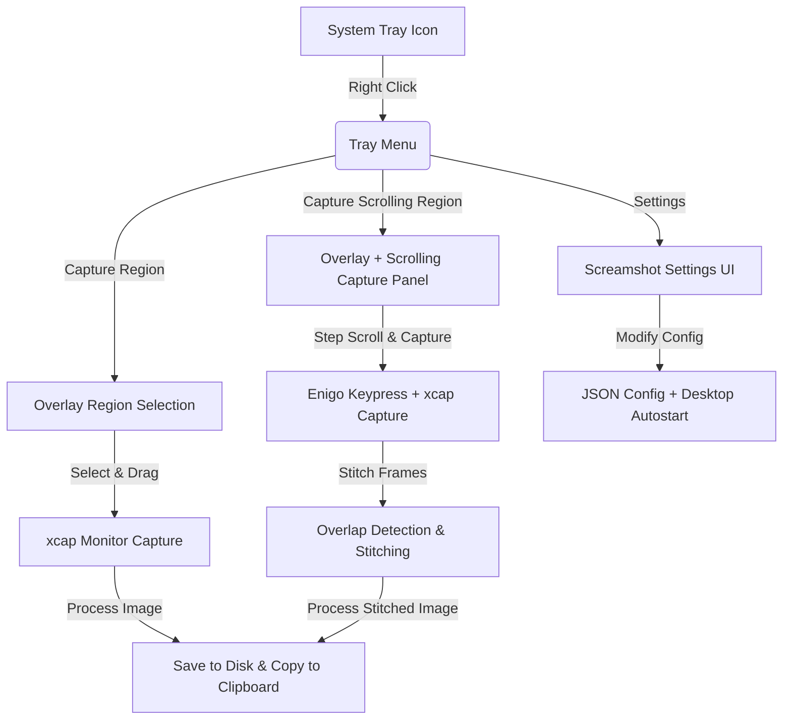

# Screamshot 🚀

Screamshot is a premium, lightweight, and modern screen capture and scrolling-capture tool designed specifically for Linux desktop environments (X11 & Wayland). Powered by Rust, `egui`, and `xcap`, Screamshot allows users to select custom screen regions, perform dynamic scrolling captures with automatic vertical stitching, copy output to their clipboard instantly, and personalize application preferences through a sleek Settings panel.



---

## ✨ Features

- **🎯 Region Capture**: Interactive click-and-drag overlay supporting freeform region selection with absolute accuracy.
- **🔄 Scrolling Region Capture**: Select a custom region, perform manual step-by-step vertical scrolling, and watch the software automatically align and stitch frames into a single high-resolution image using our advanced pixel-level overlap matching algorithm.
- **⚙️ Premium Settings Manager**:
  - **Startup Autostart**: Enable/disable automatic launching on system login using Freedesktop standard desktop entries.
  - **Default Output Folder**: Customize where your screenshots land with an integrated native directory picker.
  - **Auto-Preview**: Instantly open completed captures using your system's default image viewer (`xdg-open`).
- **📋 Instant Clipboard Integration**: Images are automatically written to your system clipboard (Wayland & X11 compatible) for instant sharing.
- **🔔 Desktop Notifications**: Desktop-native notifications keep you updated on the capture's status.
- **🛡️ Intelligent Match Protection**: Safe color-mismatch guard prevents glitched stitching if unrelated contents are scrolled, fallback-appending them cleanly. Duplicate/stationary frame skipping avoids overhead.

---

## 🗺️ Roadmap & Future Features

We are actively designing and developing the next generation of Screamshot features. Below are the key pillars of our future roadmap:

- **🎨 Premium Post-Capture Editor HUD**: A non-intrusive floating editor panel after capture, allowing real-time annotation with vector arrows, highlight brushes, text boxes, and step-counters.
- **🛡️ Smart Blur & Redaction**: A drag-to-blur tool inside the Editor HUD to instantly pixelate or black out private information (like API keys, credentials, or personal details) in your captures.
- **🔍 Instant OCR (Text Extraction)**: Copy text directly out of screenshots! One-click local OCR engine integration to extract non-copyable text directly into your system clipboard.
- **⌨️ System-Wide Global Hotkeys**: Bind custom global shortcuts (such as `Super + Shift + S`) natively under Linux desktop environments to trigger region or scrolling captures instantly without tray navigation.
- **🌐 One-Click Cloud Sharing**: Instant, optional, and secure uploads to modern hosting platforms (like Imgur, custom S3/MinIO buckets, or private media hosters) with auto-copied shareable markdown/HTML URLs.
- **🎞️ Region Screen Recording & GIFs**: Expand region selection to record high-FPS animated GIFs or lightweight MP4 screen recordings of your custom screen bounds.

---

## 🚀 Automatic Installation

Screamshot includes a fully-automated, interactive installation script `install.sh` that detects dependencies, updates system headers, compiles in highly-optimized release mode, moves the binary to standard user folders, and integrates the app natively into your Linux desktop launcher (GNOME, etc.).

Simply run:
```bash
./install.sh
```

---

## 🛠️ Manual Installation (Optional)

If you prefer to perform steps manually:

### 1. Install Prerequisites
```bash
sudo apt update
sudo apt install -y \
    libdbus-1-dev libxdo-dev libxcb-shape0-dev libxcb-xfixes0-dev \
    libxkbcommon-dev libgtk-3-dev clang pkg-config build-essential
```

### 2. Build & Copy Binary
```bash
cargo build --release
mkdir -p ~/.local/bin
cp target/release/screamshot ~/.local/bin/screamshot
chmod +x ~/.local/bin/screamshot
```

### 3. Register System App Launcher
Running `/home/phangs/.local/bin/screamshot` once will automatically generate its system desktop entry at `~/.local/share/applications/screamshot.desktop` for menu search availability!

---

## 🔬 Running Automated Tests
Screamshot includes a rigorous suite of automated unit tests validating overlap bounds, threshold safety guards, and frame stitching integrity.
```bash
cargo test
```

---

## 📁 Configuration Details
All application configuration preferences are safely stored in JSON format at:
`~/.config/screamshot/config.json`

Desktop autostart integration resides under:
`~/.config/autostart/screamshot.desktop`
